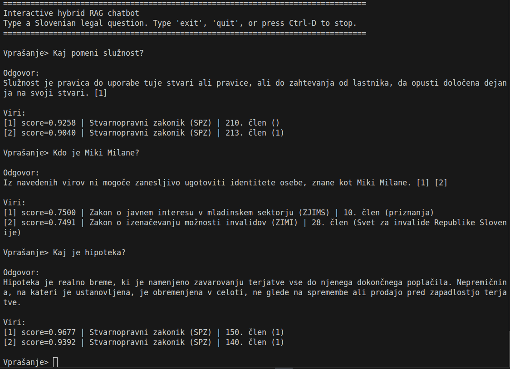

# Natural language processing course: A RAG-Based Slovenian Legal Assistant for Real-Estate Law

Conversational AI assistant for Slovenian law.

## Project overview

This project implements a retrieval-augmented generation (RAG) system for Slovenian legal question answering. The system focuses on real-estate and property-law legislation from PISRS/COLESLAW. Legal documents are filtered, split into article-level chunks, embedded with BGE-M3, stored in a FAISS index, retrieved for a user question, and passed to a Slovenian instruction-tuned language model.

The full runnable experiment environment, including cached models, indexes, logs, and large intermediate files, is available on ARNES:

```text
/d/hpc/projects/onj_fri/pad-siew/law-rag
```

The GitHub repository contains the main scripts, evaluation sets, selected outputs, result tables, and report files. Large raw data, model caches, FAISS indexes, and full logs are not committed.


# Running on ARNES


## Interactive chatbot

The simplest way to run the RAG system is as an interactive terminal chatbot on the Arnes cluster. It loads the FAISS index, BM25 index, BGE-M3 embedder, and GaMS3-12B model once, then lets you ask questions directly in the terminal.

First, log in to ARNES and go to the project folder:

```bash
cd /d/hpc/projects/onj_fri/pad-siew/law-rag
```

Start an interactive GPU session:

```bash
srun --partition=gpu --gpus=1 --cpus-per-task=8 --mem=64G --time=00:30:00 --pty bash
```

After the job is allocated, run:

```bash
apptainer exec --nv \
  --bind /d/hpc/projects/onj_fri:/d/hpc/projects/onj_fri \
  --bind $HOME:$HOME \
  --pwd /d/hpc/projects/onj_fri/pad-siew/law-rag \
  /d/hpc/singularity/pytorch-24.12-py3.sif \
  $HOME/law-rag-gemma3/venv/bin/python -u scripts/rag_eval_INTERACTIVE.py \
    --interactive \
    --show-sources \
    --model cjvt/GaMS3-12B-Instruct \
    --context-n 2 \
    --prompt-id p2 \
    --max-context-chars 1200 \
    --max-new-tokens 220 \
    --bm25-index index/real_estate_bm25.pkl \
    --hybrid-alpha 0.75 \
    --candidate-k 50
```

The chatbot prompt looks like this:

```text
Vprašanje>
```

Type a Slovenian legal question and press Enter. Type `exit`, `quit`, `q`, or `konec` to stop the chatbot. With `--show-sources`, the model also prints the retrieved legal sources used for the answer.




## Arnes setup for running jobs

### 1. Login

From your local machine, replace `USERNAME` with your ARNES username:

```bash
ssh -i ~/.ssh/id_ed25519_arnes USERNAME@hpc-login3.arnes.si
```

or:

```bash
ssh USERNAME@hpc-login4.arnes.si
```

### 2. Navigate to the shared project folder

```bash
cd /d/hpc/projects/onj_fri/pad-siew/law-rag
ls
```

### 3. Create your private virtual environment

Run this once:

```bash
cd ~
mkdir -p ~/law-rag
cd ~/law-rag

apptainer exec /d/hpc/singularity/pytorch-24.12-py3.sif \
  python -m venv --system-site-packages venv
```

### 4. Install project dependencies

Upgrade pip and install dependencies:


```bash
apptainer exec \
  --bind /d/hpc/projects/onj_fri:/d/hpc/projects/onj_fri \
  --bind $HOME:$HOME \
  --pwd $HOME/law-rag \
  /d/hpc/singularity/pytorch-24.12-py3.sif \
  ./venv/bin/pip install --upgrade pip

apptainer exec \
  --bind /d/hpc/projects/onj_fri:/d/hpc/projects/onj_fri \
  --bind $HOME:$HOME \
  --pwd $HOME/law-rag \
  /d/hpc/singularity/pytorch-24.12-py3.sif \
  ./venv/bin/pip install -r /d/hpc/projects/onj_fri/pad-siew/law-rag/requirements.txt
```

### 5. Verify the environment

```bash
cd /d/hpc/projects/onj_fri/pad-siew/law-rag

apptainer exec \
  --bind /d/hpc/projects/onj_fri:/d/hpc/projects/onj_fri \
  --bind $HOME:$HOME \
  --pwd /d/hpc/projects/onj_fri/pad-siew/law-rag \
  /d/hpc/singularity/pytorch-24.12-py3.sif \
  $HOME/law-rag/venv/bin/python -c "import torch, transformers, sentence_transformers, faiss; print('OK'); print(torch.__version__); print(transformers.__version__)"
```

Expected output starts with:

```text
OK
```

### 6. HuggingFace login

If the model is not already cached, log in:

```bash
hf auth login
```

Paste your HuggingFace token when prompted. The model will download automatically when first used.

## Asking the model a custom question

The simplest way to ask a custom question is to create a one-question JSONL file and run the final RAG script.

### 1. Create a demo question

```bash
cd /d/hpc/projects/onj_fri/pad-siew/law-rag
mkdir -p data/eval

cat > data/eval/demo_question.jsonl <<'EOF'
{"id":"demo001","question":"Kaj pomeni služnost?","type":"demo"}
EOF
```

You can replace the question with any Slovenian legal question.

### 2. Start an interactive GPU session

```bash
srun --partition=gpu --gpus=1 --cpus-per-task=8 --mem=64G --time=01:00:00 --pty bash
```

(or preferably run as sbatch job)

### 3. Run the RAG setup

```bash
apptainer exec --nv \
  --bind /d/hpc/projects/onj_fri:/d/hpc/projects/onj_fri \
  --bind $HOME:$HOME \
  --pwd /d/hpc/projects/onj_fri/pad-siew/law-rag \
  /d/hpc/singularity/pytorch-24.12-py3.sif \
  $HOME/law-rag/venv/bin/python -u scripts/rag_eval_dense.py \
    --questions data/eval/demo_question.jsonl \
    --model cjvt/GaMS3-12B-Instruct \
    --context-n 2 \
    --prompt-id p2 \
    --max-context-chars 1200 \
    --max-new-tokens 220 \
    --run-name demo_question
```

### 4. Read the answer

The output is saved in:

```text
data/outputs/
```

Find the newest demo output:

```bash
ls -t data/outputs/*demo_question* | head -1
cat $(ls -t data/outputs/*demo_question* | head -1)
```

The JSONL output contains the question, retrieved legal chunks, and generated answer.


## Optional evaluation jobs on test questions

Dense RAG:

```bash
sbatch jobs/final_rag_12b_50q.sbatch
```

Hybrid BM25 + dense RAG:

```bash
sbatch jobs/final_rag_hybrid_12b_50q.sbatch
```

## Data, dependencies, and reproducibility

This repo contains:

```text
code/                  Main scripts
code/experiments/      Experiment scripts
code/jobs/             Jobs used to run scripts as sbatch
data/eval/             Evaluation datasets
results/               Selected outputs, graphs and summary tables
report/                Final report and figures
requirements.txt       Python dependencies
```

The project uses the PISRS part of COLESLAW. The raw corpus and large derived files are not committed to GitHub because of size. The prepared filtered chunk file, FAISS indexes, BM25 index, model caches, full logs, and full outputs are available on ARNES in the folder:

```text
/d/hpc/projects/onj_fri/pad-siew/law-rag
```
